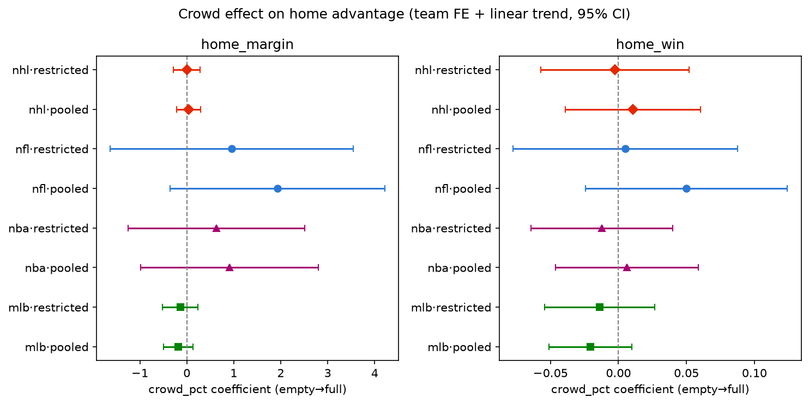

# Empty Stadiums and the Crowd Channel in Home-Field Advantage

Home teams win more often than away teams in every major North American league, but how much of
that edge comes from the crowd itself? This project uses the 2020–21 COVID attendance restrictions
as a natural experiment. It covers 30,146 NFL, MLB, NBA and NHL games (2018–2023), each with a
measured crowd dose, and estimates the crowd-attributable share of home advantage in each league.

**Paper:** [`paper/hfa.pdf`](paper/hfa.pdf) · **Five-minute summary:** [`docs/summary.md`](docs/summary.md)



## Findings

Home advantage in full-crowd regular seasons:

| | NFL | NBA | NHL | MLB |
|---|---|---|---|---|
| Home win % | 55.2% | 57.0% | 53.8% | 52.8% |
| Home scoring margin | +1.75 pts | +2.26 pts | +0.25 goals | +0.04 runs |

Estimated crowd effect on home win probability (empty → full stadium, 95% CI):

| NFL | NBA | NHL | MLB |
|---|---|---|---|
| +0.050 [−0.024, +0.124] | +0.006 [−0.046, +0.059] | +0.011 [−0.039, +0.060] | −0.021 [−0.051, +0.010] |

Every interval crosses zero. The NFL estimate is also fragile: it falls to +0.013 when the 2018
season is dropped.

**The main finding is a ceiling, not a null.** In all eight league × outcome combinations, the
smallest crowd effect this design could detect at 80% power is larger than that league's entire
home advantage. (This is per unit of crowd dose; rescaled to each league's normal-season dose,
three combinations fall to roughly one or below.) The restrictions hit whole seasons rather than
individual games, so each league contributes only one or two treated seasons. In every combination,
at least one ordinary season moved further from trend than the restricted season did. Adding more
seasons would not remove the ceiling in seven of the eight combinations. The empty-stadium
experiment, at the scale of a single league, cannot settle how much of home advantage the crowd
explains.

## Approach

- **Data.** Schedules, scores and announced attendance from ESPN's public endpoints, normalized into
  one game-level panel for all four leagues. League-specific code lives only in the loaders;
  everything downstream is league-agnostic.
- **Crowd dose.** Announced attendance divided by each venue-season's maximum announced attendance.
  ESPN does not report seated capacity, and announced attendance often exceeds it anyway.
- **Estimators.** (1) A team fixed-effects dose-response regression with a linear season trend,
  controlling for team strength (Elo), rest and travel. (2) A comparative interrupted time series
  with the away team as the implicit control. Outcomes are scoring margin and home win (linear
  probability model), with standard errors clustered by home team. Season fixed effects are left out
  because the treatment is almost entirely a season-level event and they would absorb it.
- **Exclusions.** Neutral-site, relocated-home, bubble and playoff games.
- **Robustness.** Leave-one-season-out, randomization inference over season assignments, a
  season-level noise-floor decomposition, and a cross-league meta-analysis.

The main limitation is that the design cannot separate the crowd from anything else home-specific
that changed in 2020–21. The paper covers this and the other caveats in full.

## Reproducing

Requires Python 3.11+ and, to render the paper, the [Quarto](https://quarto.org) CLI.

```bash
python -m venv .venv
.venv/bin/pip install -r requirements.txt
.venv/bin/python -m ipykernel install --sys-prefix --name hfa   # kernel the paper renders with
.venv/bin/pytest -q

# 1. Load each league from ESPN → data/interim/
.venv/bin/python -m src.data.nfl
.venv/bin/python -m src.data.mlb
.venv/bin/python -m src.data.nba
.venv/bin/python -m src.data.nhl

# 2. Features (Elo, rest, travel, crowd dose) → data/processed/
.venv/bin/python -m src.features.build

# 3. Analysis → results/tables/ and results/figures/
.venv/bin/python -m src.viz.descriptive
.venv/bin/python -m src.models.twfe
.venv/bin/python -m src.models.did
.venv/bin/python -m src.models.sensitivity

# 4. Paper
cd paper && QUARTO_PYTHON=../.venv/bin/python quarto render hfa.qmd
```

Raw data is not redistributed. The loaders cache every ESPN response under `data/raw/`, and ESPN
rate-limits bulk requests to roughly 30 per minute, so a first full pull takes several hours
(MLB is the longest). Re-runs resume from the cache.

## Repository layout

```
config/sports.yaml   restriction windows and per-league settings
src/data/            per-league loaders → unified panel
src/schema.py        panel schema and validation
src/features/        Elo, rest, travel, crowd dose
src/models/          both estimators and the sensitivity analyses
src/viz/             descriptive tables and figures
results/             generated tables and figures
paper/               Quarto source and rendered paper
docs/                design decisions, data notes, results index, literature review, build specs
tests/
```

## Built with Claude Code

This project was built with [Claude Code](https://claude.com/claude-code), which wrote most of the code and drafted the
paper's prose. I set the research question and design, made the methodological calls, and reviewed the results.

## License

Code is released under the [MIT License](LICENSE). The paper is not covered by it.
